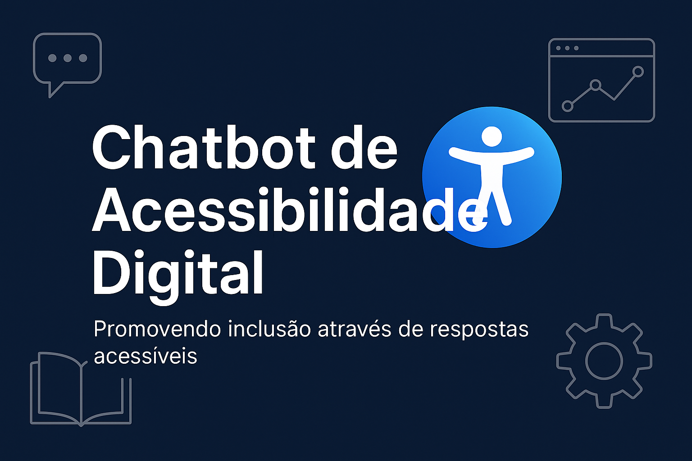

<p align="center">
  
</p>
<p align="center">
  <strong>Um assistente inteligente para tornar a web mais acessível. 💡</strong>
</p>

# ♿ Chatbot de Acessibilidade Digital

Um assistente inteligente para responder dúvidas sobre acessibilidade digital, com foco em qualidade de software e usabilidade para pessoas com deficiência.

[](https://www.python.org/)
[](LICENSE)

---

## ✨ Visão Geral

Este projeto é um chatbot acessível e didático, voltado para profissionais, desenvolvedores e equipes de qualidade que desejam tirar dúvidas sobre acessibilidade digital. A solução utiliza a API Gemini da Google (via Google ADK) para gerar respostas completas, testáveis e com referências confiáveis.

💬 Exemplos de perguntas:
- Como testar contraste de cores?
- O que é navegação por teclado?
- Como tornar um site acessível a leitores de tela?

---

## 🔍 Funcionalidades

✅ Respostas claras com exemplos práticos  
✅ Validação técnica com base em WCAG e ARIA  
✅ Reescrita para linguagem acessível e inclusiva  
✅ Sugestões de testes práticos com ferramentas como axe, NVDA, Lighthouse  
✅ Recomendações de estudo com links úteis, cursos e livros

---

## 🧠 Arquitetura

O projeto é organizado em módulos, com agentes especializados para cada etapa da resposta:

```
chatbot_acessibilidade/
│
├── agents/               # Define os agentes (assistente, revisor, etc.)
├── core/                 # Funções utilitárias (ex: validadores, formatadores)
├── pipeline.py           # Pipeline principal que orquestra todos os agentes
├── app.py                # Frontend com Streamlit
├── assets/               # Imagens e CSS customizado
│   ├── banner.png
│   └── style.css
├── setup.sh              # Script de instalação automática
├── requirements.txt      # Dependências do projeto
└── .env                  # Chave da API Google (não versionar)
```

---

## 🚀 Como Executar Localmente

1. Clone o repositório:

```bash
git clone https://github.com/seuusuario/chatbot-acessibilidade.git
cd chatbot-acessibilidade
```

2. Crie e ative o ambiente virtual:

```bash
python3 -m venv .venv
source .venv/bin/activate
```

3. Instale as dependências:

```bash
pip install -r requirements.txt
```

4. Configure sua chave da API:

Crie um arquivo `.env` com o seguinte conteúdo:

```env
GOOGLE_API_KEY="sua_chave_aqui"
```

5. Rode o projeto com o Streamlit:

```bash
streamlit run app.py
```

---

## 🔧 Instalação Rápida com Script

Você também pode usar o script `setup.sh`:

```bash
chmod +x setup.sh
./setup.sh
```

---

## 🧑‍🦽 Acessibilidade Otimizada (Lighthouse 100/100)

Este projeto segue as melhores práticas de acessibilidade:

- Contraste de cores reforçado
- Foco visível para navegação por teclado
- Campo de entrada fixo no rodapé (estilo chat)
- Labels e imagens com descrição para leitores de tela
- Substituição de `use_column_width` por `use_container_width`

---

## ☁️ Deploy com Streamlit Cloud

Você pode testar gratuitamente:

1. Acesse: https://streamlit.io/cloud  
2. Conecte sua conta GitHub  
3. Escolha o repositório  
4. Configure o secret:

```toml
GOOGLE_API_KEY = "sua_chave_aqui"
```

5. Clique em “Deploy” e compartilhe o link

---

## 📚 Tecnologias Utilizadas

- Python 3.10+
- Google Gemini API (via Google ADK)
- Streamlit
- dotenv
- axe-core, Lighthouse, NVDA

---

## 🙋 Sobre a Autora

Desenvolvido por **Joelma De Oliveira Prestes Ferreira**, Líder de Engenharia de Qualidade com ampla experiência em testes, acessibilidade e automação.

🔗 [LinkedIn](https://www.linkedin.com/in/joprestes84/)  
💌 joprestes@hotmail.com

---

## 📄 Licença

Distribuído sob a [MIT License](LICENSE).

---

## 🌐 English Version

<p align="center">
  
</p>
<p align="center">
  <strong>An intelligent assistant to make the web more accessible. 💡</strong>
</p>

# ♿ Digital Accessibility Chatbot

An inclusive chatbot to answer digital accessibility questions, focused on software quality and usability for people with disabilities.

---

## ✨ Overview

This chatbot is designed for developers, QA teams, and accessibility advocates who want to understand how to improve the web for everyone. It uses Google's Gemini API to generate accurate, inclusive, and testable answers.

💬 Example questions:
- How do I test color contrast?
- What is keyboard navigation?
- How to make a website accessible to screen readers?

---

## 🔍 Features

✅ Clear answers with practical examples  
✅ Based on WCAG and ARIA standards  
✅ Accessible and inclusive rephrasing  
✅ Testing suggestions with tools like axe, NVDA, Lighthouse  
✅ Study recommendations with links, courses, and books

---

## 🧠 Project Structure

```
chatbot_acessibilidade/
│
├── agents/               # Specialized answer agents
├── core/                 # Helpers (validators, formatters)
├── pipeline.py           # Response pipeline
├── app.py                # Streamlit UI
├── assets/               # CSS and image assets
│   ├── banner.png
│   └── style.css
├── setup.sh              # Setup script for local install
├── requirements.txt      # Project dependencies
└── .env                  # API key (not versioned)
```

---

## 🚀 Running Locally

```bash
git clone https://github.com/youruser/chatbot-acessibilidade.git
cd chatbot-acessibilidade

python3 -m venv .venv
source .venv/bin/activate

pip install -r requirements.txt
```

Create a `.env` file:

```env
GOOGLE_API_KEY="your_api_key_here"
```

Then run:

```bash
streamlit run app.py
```

---

## 🔧 Quick Install (optional)

```bash
chmod +x setup.sh
./setup.sh
```

---

## 🧑‍🦽 Accessibility Score: 100/100

This chatbot was designed for maximum accessibility:

- Strong color contrast and large font
- Keyboard navigation and visible focus
- Accessible input with labels and clear language
- Fixed footer input (chat-like interface)
- Image descriptions and proper HTML structure

---

## ☁️ Deploy to Streamlit Cloud

1. Go to https://streamlit.io/cloud  
2. Connect your GitHub  
3. Select the repository and set `app.py` as the entry point  
4. Add secret:

```toml
GOOGLE_API_KEY = "your_api_key"
```

5. Click **Deploy** – share the link with your team ✅

---

## 📚 Tech Stack

- Python 3.10+
- Streamlit
- Google Generative AI (Gemini)
- dotenv
- Accessibility tools: axe-core, NVDA, Lighthouse

---

## 🙋 About the Author

Built by **Joelma De Oliveira Prestes Ferreira**, QA Engineering Lead passionate about accessibility, inclusion, and automation.

🔗 [LinkedIn](https://www.linkedin.com/in/joprestes84/)  
📧 joprestes@hotmail.com

---

## 📄 License

Licensed under the [MIT License](LICENSE).
