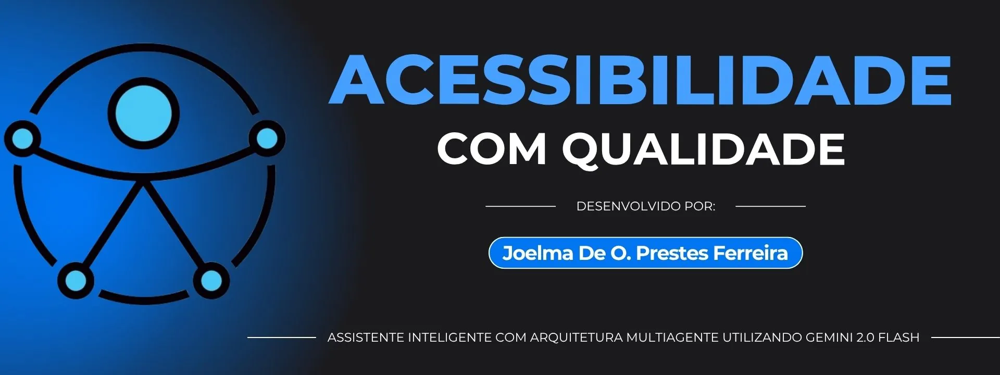

<div align="center">

# ♿ Chatbot de Acessibilidade Digital

**Um assistente inteligente para tornar a web mais acessível** 💡

[](https://www.python.org/)
[](https://fastapi.tiangolo.com/)
[](LICENSE)
[](https://github.com/psf/black)

[Português 🇧🇷](#-versão-em-português) | [English 🇺🇸](#-english-version)

---



**Desenvolvido por:** [Joelma De O. Prestes Ferreira](https://www.linkedin.com/in/joprestes84/)

</div>

---

## 📑 Índice

<details>
<summary>Clique para expandir</summary>

- [🇧🇷 Versão em Português](#-versão-em-português)
  - [✨ Visão Geral](#-visão-geral)
  - [🎯 Funcionalidades](#-funcionalidades)
  - [🏗️ Arquitetura](#️-arquitetura)
  - [🚀 Quick Start](#-quick-start)
  - [📖 Documentação](#-documentação)
  - [🧪 Testes e Qualidade](#-testes-e-qualidade)
  - [🔒 Segurança](#-segurança)
  - [🌐 Deploy](#-deploy)
  - [🛠️ Tecnologias](#️-tecnologias)
  - [👤 Sobre a Autora](#-sobre-a-autora)
- [🇺🇸 English Version](#-english-version)

</details>

---

## 🇧🇷 Versão em Português

### ✨ Visão Geral

O **Chatbot de Acessibilidade Digital** é uma solução inteligente e educativa desenvolvida para profissionais, desenvolvedores e equipes de QA que buscam aprimorar seus conhecimentos sobre acessibilidade digital. 

Utilizando a **API Gemini 2.0 Flash** da Google (via Google ADK), o chatbot gera respostas completas, testáveis e com referências confiáveis, seguindo os padrões **WCAG** e **ARIA**.

#### 💬 Exemplos de Perguntas

| Categoria | Exemplo |
|-----------|---------|
| **Testes** | Como testar contraste de cores? |
| **Navegação** | O que é navegação por teclado? |
| **Leitores de Tela** | Como tornar um site acessível a leitores de tela? |
| **WCAG** | Quais são os critérios de sucesso do WCAG 2.1? |
| **Ferramentas** | Quais ferramentas usar para testar acessibilidade? |

---

### 🎯 Funcionalidades

<div align="center">

| 🎨 **Interface** | 🔧 **Técnico** | 📚 **Educativo** |
|:---:|:---:|:---:|
| ✅ Interface acessível (WCAG AA) | ✅ Validação técnica WCAG/ARIA | ✅ Exemplos práticos |
| ✅ Layout moderno com sidebar | ✅ Multiagente especializado | ✅ Sugestões de testes |
| ✅ Paleta "Lavanda Inclusiva" | ✅ Rate limiting | ✅ Materiais de estudo |
| ✅ Tema claro/escuro | ✅ Logging estruturado | ✅ Links e referências |
| ✅ Toast notifications | ✅ Métricas de performance | ✅ Histórico de conversas |
| ✅ Skeleton loading | ✅ Cache inteligente | ✅ Busca no histórico |
| ✅ Textarea auto-expansível | ✅ Testes E2E completos | ✅ Timestamps nas mensagens |

</div>

#### 🧠 Arquitetura Multiagente

O chatbot utiliza **5 agentes especializados** trabalhando em conjunto:

1. **🤖 Assistente** - Gera a resposta inicial
2. **✅ Validador** - Valida técnica (WCAG, ARIA)
3. **✍️ Revisor** - Simplifica a linguagem
4. **🧪 Testador** - Sugere testes práticos *(paralelo)*
5. **📚 Aprofundador** - Recomenda materiais *(paralelo)*

---

### 🏗️ Arquitetura

```
chatbot-acessibilidade/
├── 📚 docs/                       # Documentação completa
│   ├── guides/                   # Guias de uso
│   ├── api/                      # Documentação da API
│   ├── development/              # Guias de desenvolvimento
│   ├── CHANGELOG.md              # Histórico de mudanças
│   ├── INSTRUCOES_EXECUCAO.md   # Guia de execução
│   ├── LINTERS.md                # Guia de linters
│   └── REGRAS_REVISAO.md         # Regras e padrões do projeto
│
├── 🤖 src/                       # Código fonte
│   ├── chatbot_acessibilidade/   # Core do chatbot
│   │   ├── agents/               # Agentes especializados
│   │   ├── core/                 # Utilitários e formatters
│   │   └── pipeline.py           # Orquestração dos agentes
│   └── backend/                  # API REST
│       └── api.py                # FastAPI endpoints
│
├── 💻 frontend/                  # Interface Web
│   ├── index.html                # HTML acessível
│   ├── styles.css                # Estilos responsivos
│   └── app.js                    # Lógica JavaScript
│
├── 🧪 tests/                     # Testes automatizados
│   ├── unit/                     # Testes unitários
│   ├── integration/              # Testes de integração
│   ├── reports/                  # Relatórios de testes
│   └── test_*.py                 # Arquivos de teste
│
├── 📦 static/                     # Recursos estáticos
│   └── images/                   # Imagens (banner, avatar)
│
├── 🔧 scripts/                   # Scripts auxiliares
│   └── setup/                    # Scripts de configuração
│
├── 📄 README.md                   # Este arquivo
├── ⚙️  requirements.txt          # Dependências Python
├── 🛠️  pyproject.toml            # Configuração do projeto
├── 🔨 Makefile                   # Comandos de automação
└── 📜 LICENSE                    # Licença do projeto
```

---

### 🚀 Quick Start

#### 📋 Pré-requisitos

- Python 3.12 ou superior (recomendado 3.12.x)
- Chave da API Google Gemini
- Git

#### 🔧 Instalação

```bash
# 1. Clone o repositório
git clone https://github.com/joprestes/chatbotAcessibilidade.git
cd chatbotAcessibilidade

# 2. Crie e ative o ambiente virtual
python3 -m venv .venv
source .venv/bin/activate  # No Windows: .venv\Scripts\activate

# 3. Instale as dependências
pip install -r requirements.txt
```

#### 🔑 Configuração

Crie um arquivo `.env` na raiz do projeto:

```env
# Chave da API Google Gemini (obrigatória)
GOOGLE_API_KEY="sua_chave_aqui"

# OpenRouter (opcional - para fallback automático)
OPENROUTER_API_KEY="sua_chave_openrouter"
FALLBACK_ENABLED=true
OPENROUTER_MODELS=meta-llama/llama-3.3-70b-instruct:free,google/gemini-flash-1.5:free,mistralai/mistral-7b-instruct:free

# CORS (opcional - padrão: *)
CORS_ORIGINS="*"

# Rate Limiting (opcional)
RATE_LIMIT_ENABLED=true
RATE_LIMIT_PER_MINUTE=10

# Logging (opcional)
LOG_LEVEL=INFO
```

> 💡 **Dica:** Veja `.env.example` para todas as opções disponíveis.

#### 🔄 Sistema de Fallback Automático

O chatbot agora suporta **fallback automático** entre múltiplos LLMs:

1. **Provedor Primário**: Google Gemini (padrão)
2. **Provedor Secundário**: OpenRouter com modelos gratuitos
3. **Comportamento**: Se o Gemini esgotar quota ou falhar, o sistema automaticamente tenta modelos OpenRouter em sequência

**Modelos OpenRouter Gratuitos Recomendados:**
- `meta-llama/llama-3.3-70b-instruct:free`
- `google/gemini-flash-1.5:free`
- `mistralai/mistral-7b-instruct:free`
- `qwen/qwen-2.5-7b-instruct:free`
- `microsoft/phi-3-medium-4k-instruct:free`

**Para habilitar o fallback:**
1. Obtenha uma chave API do [OpenRouter](https://openrouter.ai/)
2. Configure `OPENROUTER_API_KEY` no `.env`
3. Configure `FALLBACK_ENABLED=true`
4. Opcionalmente, ajuste `OPENROUTER_MODELS` com seus modelos preferidos

#### ▶️ Execução

**Frontend Web Moderno** ⭐

```bash
uvicorn src.backend.api:app --reload --port 8000
```

Acesse: **http://localhost:8000**

**Características da Interface:**
- 🎨 Layout moderno com sidebar fixa (Ada no lado esquerdo)
- 💜 Paleta "Lavanda Inclusiva" (roxo/lilás acessível)
- 📱 Design responsivo e mobile-first
- 🔔 Toast notifications acessíveis
- ⏳ Skeleton loading durante processamento
- 📝 Textarea auto-expansível com glassmorphism
- 👤 Avatares e timestamps nas mensagens
- 🌙 Tema claro/escuro com transições suaves

---

### 📖 Documentação

| Documento | Descrição |
|:---------:|:----------|
| [📘 INSTRUCOES_EXECUCAO.md](docs/INSTRUCOES_EXECUCAO.md) | Guia detalhado de execução |
| [🔍 LINTERS.md](docs/LINTERS.md) | Guia de linters e formatação |
| [📝 CHANGELOG.md](docs/CHANGELOG.md) | Histórico de mudanças |
| [📋 REGRAS_REVISAO.md](docs/REGRAS_REVISAO.md) | Regras e padrões do projeto |
| [🚀 DEPLOY.md](docs/DEPLOY.md) | Guia completo de deploy |
| [🧪 TESTES.md](docs/TESTES.md) | Documentação de testes |

---

### 🧪 Testes e Qualidade

#### 🧪 Executar Testes

```bash
# Testes básicos
pytest -v

# Com relatório HTML
pytest --html=relatorio_testes.html --self-contained-html

# Com cobertura
pytest --cov=chatbot_acessibilidade --cov=backend --cov-report=html
```

#### 🔍 Linters e Formatação

```bash
# Instalar ferramentas
make install

# Formatar código
make format

# Verificar lint
make lint

# Verificar tipos
make type-check

# Executar todas as verificações
make check
```

> 📚 Veja [LINTERS.md](LINTERS.md) para mais detalhes.

---

### 🔒 Segurança

O projeto implementa várias camadas de segurança:

| Recurso | Descrição |
|:-------:|:----------|
| 🔐 **CORS Configurável** | Controle de origens permitidas |
| 🛡️ **Rate Limiting** | Proteção contra abuso (10 req/min) |
| ✅ **Validação de Entrada** | Sanitização e limites (3-2000 chars) |
| 📝 **Logging Estruturado** | Rastreamento de atividades |
| 🔑 **Variáveis de Ambiente** | Segredos não versionados |

---

### 🌐 Deploy

Veja o guia completo de deploy em [docs/DEPLOY.md](docs/DEPLOY.md) que inclui:
- Configuração de servidor web (Nginx, Caddy)
- Configuração HTTPS com Certbot
- CDN (Cloudflare, AWS CloudFront)
- Variáveis de ambiente de produção
- Monitoramento e logs

#### 🐳 Docker (Em breve)

```bash
# Em desenvolvimento
docker-compose up
```

---

### 🛠️ Tecnologias

<div align="center">

| Categoria | Tecnologias |
|:---------:|:-----------|
| **🐍 Backend** | Python 3.12+, FastAPI, Uvicorn |
| **🤖 IA** | Google Gemini 2.0 Flash, Google ADK, OpenRouter (fallback) |
| **💻 Frontend** | HTML5, CSS3, JavaScript (Vanilla), Glassmorphism |
| **🧪 Testes** | Pytest, Pytest-cov, Testes E2E |
| **🔍 Qualidade** | Black, Ruff, MyPy, Pre-commit |
| **📊 Métricas** | Coleta de performance e uso |

</div>

---

### 👤 Sobre a Autora

<div align="center">

**Joelma De Oliveira Prestes Ferreira**

[](https://www.linkedin.com/in/joprestes84/)
[](https://medium.com/@joprestes)
[](mailto:joprestes@hotmail.com)

</div>

---

### 📄 Licença

Este projeto está licenciado sob a **Licença MIT**. Veja o arquivo [LICENSE](LICENSE) para detalhes.

> 📖 Uma tradução não-oficial para o português está disponível [aqui](LICENSE.pt-BR.md).

---

## 🇺🇸 English Version

### ✨ Overview

The **Digital Accessibility Chatbot** is an intelligent and educational solution developed for professionals, developers, and QA teams seeking to enhance their knowledge about digital accessibility.

Using Google's **Gemini 2.0 Flash API** (via Google ADK), the chatbot generates comprehensive, testable responses with trusted references, following **WCAG** and **ARIA** standards.

#### 💬 Example Questions

| Category | Example |
|----------|---------|
| **Testing** | How do I test color contrast? |
| **Navigation** | What is keyboard navigation? |
| **Screen Readers** | How to make a website accessible to screen readers? |
| **WCAG** | What are the WCAG 2.1 success criteria? |
| **Tools** | Which tools should I use to test accessibility? |

---

### 🎯 Features

<div align="center">

| 🎨 **Interface** | 🔧 **Technical** | 📚 **Educational** |
|:---:|:---:|:---:|
| ✅ Accessible interface (WCAG AA) | ✅ WCAG/ARIA technical validation | ✅ Practical examples |
| ✅ Light/dark theme | ✅ Specialized multi-agent | ✅ Testing suggestions |
| ✅ Responsive | ✅ Rate limiting | ✅ Study materials |
| ✅ Keyboard navigation | ✅ Structured logging | ✅ Links and references |

</div>

#### 🧠 Multi-Agent Architecture

The chatbot uses **5 specialized agents** working together:

1. **🤖 Assistant** - Generates initial response
2. **✅ Validator** - Technical validation (WCAG, ARIA)
3. **✍️ Reviewer** - Simplifies language
4. **🧪 Tester** - Suggests practical tests *(parallel)*
5. **📚 Deepener** - Recommends materials *(parallel)*

---

### 🏗️ Project Structure

```
chatbot-acessibilidade/
├── 🤖 src/                       # Source code
│   ├── chatbot_acessibilidade/   # Chatbot core
│   │   ├── agents/               # Specialized agents
│   │   ├── core/                 # Utilities and formatters
│   │   └── pipeline.py           # Agent orchestration
│   └── backend/                   # REST API
│       └── api.py                # FastAPI endpoints
│
├── 💻 frontend/                  # Web Interface
│   ├── index.html                # Accessible HTML
│   ├── styles.css                # Responsive styles
│   └── app.js                    # JavaScript logic
│
├── 🧪 tests/                     # Automated tests
│   ├── unit/                     # Unit tests
│   ├── integration/              # Integration tests
│   ├── e2e/                      # End-to-end tests
│   └── reports/                  # Test reports
│
├── 📦 static/                     # Static resources
│   └── images/                   # Images (banner, avatar)
└── ⚙️  requirements.txt          # Dependencies
```

---

### 🚀 Quick Start

#### 📋 Prerequisites

- Python 3.12 or higher (recommended 3.12.x)
- Google Gemini API key
- Git

#### 🔧 Installation

```bash
# 1. Clone the repository
git clone https://github.com/joprestes/chatbotAcessibilidade.git
cd chatbotAcessibilidade

# 2. Create and activate virtual environment
python3 -m venv .venv
source .venv/bin/activate  # On Windows: .venv\Scripts\activate

# 3. Install dependencies
pip install -r requirements.txt
```

#### 🔑 Configuration

Create a `.env` file in the project root:

```env
# Google Gemini API key (required)
GOOGLE_API_KEY="your_api_key_here"

# CORS (optional - default: *)
CORS_ORIGINS="*"

# Rate Limiting (optional)
RATE_LIMIT_ENABLED=true
RATE_LIMIT_PER_MINUTE=10

# Logging (optional)
LOG_LEVEL=INFO
```

> 💡 **Tip:** See `.env.example` for all available options.

#### ▶️ Running

**Modern Web Frontend** ⭐

```bash
uvicorn src.backend.api:app --reload --port 8000
```

Access: **http://localhost:8000**

**Interface Features:**
- 🎨 Modern layout with fixed sidebar (Ada on the left)
- 💜 "Lavanda Inclusiva" palette (accessible purple/lavender)
- 📱 Responsive and mobile-first design
- 🔔 Accessible toast notifications
- ⏳ Skeleton loading during processing
- 📝 Auto-expandable textarea with glassmorphism
- 👤 Avatars and timestamps in messages
- 🌙 Light/dark theme with smooth transitions

---

### 📖 Documentation

| Document | Description |
|:--------:|:------------|
| [📘 INSTRUCOES_EXECUCAO.md](docs/INSTRUCOES_EXECUCAO.md) | Detailed execution guide |
| [🔍 LINTERS.md](docs/LINTERS.md) | Linters and formatting guide |
| [📝 CHANGELOG.md](docs/CHANGELOG.md) | Change history |
| [📋 REGRAS_REVISAO.md](docs/REGRAS_REVISAO.md) | Project rules and standards |
| [🚀 DEPLOY.md](docs/DEPLOY.md) | Complete deployment guide |
| [🧪 TESTES.md](docs/TESTES.md) | Testing documentation |

---

### 🧪 Testing and Quality

#### 🧪 Run Tests

```bash
# Basic tests
pytest -v

# With HTML report
pytest --html=test_report.html --self-contained-html

# With coverage
pytest --cov=chatbot_acessibilidade --cov=backend --cov-report=html
```

#### 🔍 Linters and Formatting

```bash
# Install tools
make install

# Format code
make format

# Check lint
make lint

# Check types
make type-check

# Run all checks
make check
```

> 📚 See [LINTERS.md](LINTERS.md) for more details.

---

### 🔒 Security

The project implements multiple security layers:

| Feature | Description |
|:-------:|:------------|
| 🔐 **Configurable CORS** | Control of allowed origins |
| 🛡️ **Rate Limiting** | Protection against abuse (10 req/min) |
| ✅ **Input Validation** | Sanitization and limits (3-2000 chars) |
| 📝 **Structured Logging** | Activity tracking |
| 🔑 **Environment Variables** | Non-versioned secrets |

---

### 🌐 Deploy

#### ☁️ Streamlit Cloud

1. Go to [streamlit.io/cloud](https://streamlit.io/cloud)
2. Connect your GitHub
3. Configure the Secret `GOOGLE_API_KEY`
4. Click **Deploy**

#### 🐳 Docker (Coming soon)

```bash
# In development
docker-compose up
```

---

### 🛠️ Tech Stack

<div align="center">

| Category | Technologies |
|:--------:|:------------|
| **🐍 Backend** | Python 3.12+, FastAPI, Uvicorn |
| **🤖 AI** | Google Gemini 2.0 Flash, Google ADK, OpenRouter (fallback) |
| **💻 Frontend** | HTML5, CSS3, JavaScript (Vanilla), Glassmorphism |
| **🧪 Testing** | Pytest, Pytest-cov, E2E Tests |
| **🔍 Quality** | Black, Ruff, MyPy, Pre-commit |
| **📊 Metrics** | Performance and usage collection |

</div>

---

### 👤 About the Author

<div align="center">

**Joelma De Oliveira Prestes Ferreira**

[](https://www.linkedin.com/in/joprestes84/)
[](https://medium.com/@joprestes)
[](mailto:joprestes@hotmail.com)

</div>

---

### 📄 License

This project is licensed under the **MIT License**. See the [LICENSE](LICENSE) file for details.

> 📖 An unofficial Portuguese translation is available [here](LICENSE.pt-BR.md).

---

<div align="center">

**⭐ Se este projeto foi útil, considere dar uma estrela! ⭐**

Made with ❤️ by [Joelma De O. Prestes Ferreira](https://www.linkedin.com/in/joprestes84/)

</div>
